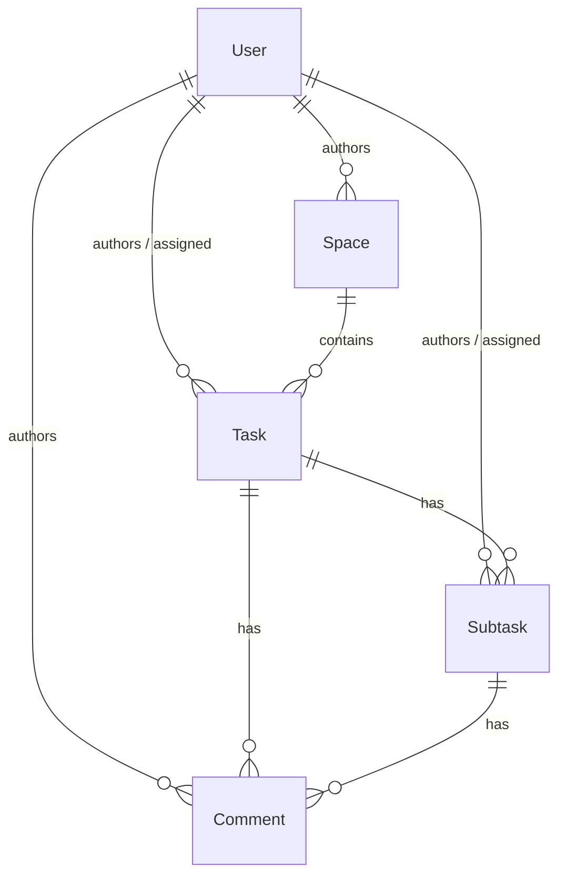

# Phase 1 Data Model: Task Planning Application

All entities live in `ZSLabs.Stride.Domain` under `Entities/` (data + constructors only, no
business logic) and enums under `Enums/`. Every entity uses an autoincrementing integer
primary key (`int Id`, SQLite `INTEGER PRIMARY KEY AUTOINCREMENT` / EF identity). All
`DateTime` values are stored in UTC. Deletes cascade to child entities (hard delete).

## Enums

### `UserRole`

| Value | Meaning |
|-------|---------|
| `Admin` | The single seeded admin; manages regular user accounts only. |
| `Regular` | Standard user; manages spaces, tasks, subtasks, comments. |

### `TaskStatus`

`Backlog`, `Todo`, `InProgress`, `Done`, `Archived` (FR-021). Default for a new task is
`Backlog` (FR-024a).

### `TaskPriority`

`Low`, `Medium`, `High`, `Critical` (FR-022). Column ordering is Critical → High → Medium →
Low, then creation date ascending (FR-026a).

### `SubtaskStatus`

`Todo`, `InProgress`, `Done` (FR-028).

## Entities

### User

| Field | Type | Required | Notes |
|-------|------|----------|-------|
| `Id` | int | yes | PK, identity. |
| `Username` | string | yes | Unique across all accounts (FR-011). |
| `PasswordHash` | string | yes | Produced by `PasswordHasher<User>`. Never returned by the API. |
| `Email` | string? | no | Optional (FR-010). |
| `Role` | `UserRole` | yes | `Admin` or `Regular`. Exactly one `Admin` exists (seeded). |
| `CreatedAt` | DateTime (UTC) | yes | Set at creation. |
| `UpdatedAt` | DateTime? (UTC) | no | Set when the account is updated. |

- Relationships: authors many `Space`, `Task`, `Subtask`, `Comment`; may be the assignee
  of many `Task`/`Subtask`.
- Validation: unique `Username`; account deletion/deactivation is not supported (FR-009).

### Space

| Field | Type | Required | Notes |
|-------|------|----------|-------|
| `Id` | int | yes | PK, identity. |
| `Key` | string | yes | User-entered, globally unique (FR-014). |
| `Name` | string | yes | Display name. |
| `AuthorId` | int (FK → User) | yes | Creator; recorded automatically (FR-013). |
| `IsPublic` | bool | yes | Public flag (FR-013). Only the author may change it (FR-016a). |
| `CreatedAt` | DateTime (UTC) | yes | Set at creation. |
| `UpdatedAt` | DateTime? (UTC) | no | Set on each write. |

- Relationships: has many `Task` (cascade delete). The board is **not** a stored entity —
  it is the view rendered when navigating to the space (FR-019).
- Validation: unique `Key`; visibility rules per FR-015–FR-017.

### Task

| Field | Type | Required | Notes |
|-------|------|----------|-------|
| `Id` | int | yes | PK, identity. |
| `SpaceId` | int (FK → Space) | yes | Owning space (cascade delete). |
| `Title` | string | yes | FR-024. |
| `Description` | string? | no | Optional (FR-025). |
| `Status` | `TaskStatus` | yes | Defaults to `Backlog` (FR-024a). |
| `Priority` | `TaskPriority` | yes | FR-024. |
| `AuthorId` | int (FK → User) | yes | Recorded at creation. |
| `AssigneeId` | int? (FK → User) | no | Must have space access (FR-030a). |
| `DueDate` | DateTime? (UTC) | no | Optional (FR-025). |
| `CreatedAt` | DateTime (UTC) | yes | Set at creation. |
| `UpdatedAt` | DateTime? (UTC) | no | Set on each write (supports last-write-wins). |

- Relationships: has many `Subtask` and many `Comment` (both cascade delete).
- Column placement by `Status`; within-column order by `Priority` then `CreatedAt` (FR-026a).

### Subtask

| Field | Type | Required | Notes |
|-------|------|----------|-------|
| `Id` | int | yes | PK, identity. |
| `TaskId` | int (FK → Task) | yes | Parent task (cascade delete). |
| `Title` | string | yes | FR-029. |
| `Description` | string? | no | Optional (FR-030). |
| `Status` | `SubtaskStatus` | yes | `Todo`/`InProgress`/`Done` (FR-028). |
| `AuthorId` | int (FK → User) | yes | Recorded at creation. |
| `AssigneeId` | int? (FK → User) | no | Must have space access (FR-030a). |
| `DueDate` | DateTime? (UTC) | no | Optional (FR-030). |
| `CreatedAt` | DateTime (UTC) | yes | Set at creation. |
| `UpdatedAt` | DateTime? (UTC) | no | Set on each write. |

- Relationships: has many `Comment` (cascade delete). Rendered as a list under the parent
  task on the board (FR-031).

### Comment

| Field | Type | Required | Notes |
|-------|------|----------|-------|
| `Id` | int | yes | PK, identity. |
| `TaskId` | int? (FK → Task) | conditional | Set when the comment is on a task. |
| `SubtaskId` | int? (FK → Subtask) | conditional | Set when the comment is on a subtask. |
| `AuthorId` | int (FK → User) | yes | FR-033. |
| `Content` | string | yes | FR-033. |
| `CreatedAt` | DateTime (UTC) | yes | Set at creation. |
| `UpdatedAt` | DateTime? (UTC) | no | Set when edited. |

- A comment is owned by **exactly one** task or subtask: exactly one of `TaskId` /
  `SubtaskId` is non-null (DB check constraint / configuration).
- Only the author may edit or delete a comment (FR-034). Comments are sorted by `CreatedAt`
  ascending (FR-035).

## Relationships Overview

Cascade delete chain (hard delete, FR-036/FR-037):
`Space → Task → Subtask → Comment`, and `Task → Comment` directly.

## Cross-Cutting Rules

- **UTC storage / local display**: the application always writes UTC-kind `DateTime` values;
  a single global EF Core convention applies a **read-only** conversion that re-tags
  materialized values as `DateTimeKind.Utc` (SQLite stores dates without an offset). The API
  returns ISO-8601 UTC (with `Z`); the client converts to local time (FR-038/FR-039).
- **Last-write-wins**: concurrent public-space edits — latest save overwrites; `UpdatedAt`
  set to `DateTime.UtcNow` on write; no conflict warning (FR-040).
- **Authorship**: `AuthorId` on Space/Task/Subtask/Comment is set automatically from the
  signed-in user at creation.
- **Access control**: private-space contents restricted to the author; public-space contents
  full-CRUD to all regular users except the Public flag (author-only).
