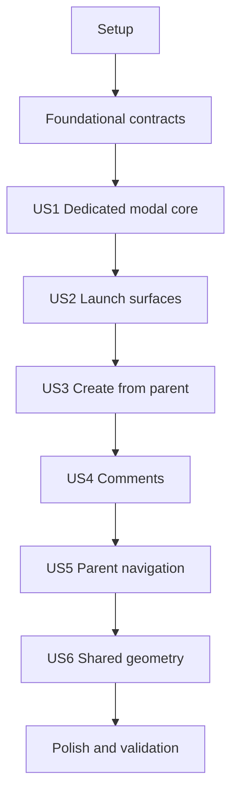

# Tasks: Dedicated Subtask Modal Dialog

**Input**: Design documents from `/specs/003-subtask-modal-dialog/`

**Prerequisites**: `plan.md`, `spec.md`, `research.md`, `data-model.md`, `contracts/openapi.yaml`, `quickstart.md`

**Tests**: Automated .NET tests are required by the project constitution. Frontend validation uses the existing TypeScript build, ESLint, and browser checks; no frontend test dependency is added.

**Organization**: Tasks are grouped by user story and implemented sequentially so each story is completed and validated before the next story begins.

## Format: `[ID] [P?] [Story] Description`

- **[P]**: Can run in parallel with other tasks in the same active phase because it changes different files and does not depend on another incomplete task; user-story phases never run in parallel
- **[Story]**: Maps a task to its user story (`US1` through `US6`)
- Every task includes an exact repository file path

## Phase 1: Setup (Shared Infrastructure)

**Purpose**: Establish a known-good baseline without adding dependencies or changing the existing project structure.

- [X] T001 Restore and run the existing backend and frontend baseline checks against `Stride.sln` and `src/ZSLabs.Stride.Web/package.json`, recording any pre-existing failures before implementation

---

## Phase 2: Foundational (Blocking Prerequisites)

**Purpose**: Align shared backend and frontend response contracts before implementing any user story.

**CRITICAL**: Complete this phase before user-story work begins.

- [X] T002 Add required `AuthorUsername` fields to the shared response records in `src/ZSLabs.Stride.Api/Contracts/Subtask.cs` and `src/ZSLabs.Stride.Api/Contracts/Comment.cs`
- [X] T003 [P] Mirror required subtask and comment author username fields in `src/ZSLabs.Stride.Web/src/api/contracts.ts`

**Checkpoint**: Backend and frontend types match `specs/003-subtask-modal-dialog/contracts/openapi.yaml`.

---

## Phase 3: User Story 1 - Open and Manage a Subtask (Priority: P1) MVP Core

**Goal**: Load an existing subtask into a dedicated modal, display all required fields, update or delete it, and keep recoverable failures in context.

**Independent Test**: Open an accessible existing subtask, verify editable and read-only fields, save changed values while the modal remains open, reopen it to confirm persistence, then cancel and confirm deletion paths.

### Tests for User Story 1

- [X] T004 [P] [US1] Add service tests for authorized single-subtask retrieval, complete author/assignee/comment-author graph loading, chronological comment order, inaccessible-space rejection, and missing IDs in `tests/ZSLabs.Stride.App.Tests/Services/SubtaskServiceTests.cs`
- [X] T005 [P] [US1] Add controller tests for `GET /subtasks/{subtaskId}` success mapping plus forbidden and not-found responses in `tests/ZSLabs.Stride.Api.Tests/Controllers/SubtasksControllerTests.cs`

### Implementation for User Story 1

- [X] T006 [US1] Add the authorized single-subtask query and author/comment-author includes in `src/ZSLabs.Stride.App/Services/ISubtaskService.cs` and `src/ZSLabs.Stride.App/Services/SubtaskService.cs`
- [X] T007 [US1] Add `GET /subtasks/{subtaskId}` and complete subtask/comment response mapping in `src/ZSLabs.Stride.Api/Controllers/SubtasksController.cs`
- [X] T008 [P] [US1] Add the typed single-subtask request in `src/ZSLabs.Stride.Web/src/api/tasks.ts`
- [X] T009 [P] [US1] Extract date-only input conversion from the task dialog into `src/ZSLabs.Stride.Web/src/utils/dateOnly.ts` and consume it from `src/ZSLabs.Stride.Web/src/components/TaskModal.tsx`
- [X] T010 [US1] Create focused load, update, delete, refresh, and recoverable-error state for one subtask in `src/ZSLabs.Stride.Web/src/hooks/useSubtask.ts`
- [X] T011 [US1] Build existing-subtask mode with editable fields, read-only author/audit values, date-only due date, ordered read-only comments, save-in-place, and confirmed deletion in `src/ZSLabs.Stride.Web/src/components/SubtaskModal.tsx`
- [X] T012 [US1] Extend the discriminated single-modal coordinator to render existing subtask state without stacking dialogs in `src/ZSLabs.Stride.Web/src/pages/SpaceBoard.tsx`

**Checkpoint**: The dedicated modal can authoritatively load, update, and delete an existing subtask while preserving retryable input and existing validation.

---

## Phase 4: User Story 2 - Reach a Subtask from Task Context (Priority: P1)

**Goal**: Open the same dedicated modal from semantic subtask links on task cards and in the parent task dialog.

**Independent Test**: Activate the same subtask from both surfaces with pointer and keyboard input and confirm the exact subtask opens without triggering task-card click or drag behavior.

### Tests for User Story 2

- [X] T013 [P] [US2] Add regression tests proving task responses order subtasks only by `CreatedAt` ascending, including equal timestamps without an ID tie-breaker, in `tests/ZSLabs.Stride.App.Tests/Services/TaskServiceTests.cs`

### Implementation for User Story 2

- [X] T014 [US2] Make task-query subtask ordering authoritative and creation-time-only in `src/ZSLabs.Stride.App/Services/TaskService.cs`
- [X] T015 [P] [US2] Replace embedded subtask forms with an ordered Title/Status/Assignee table, empty state, and semantic title links in `src/ZSLabs.Stride.Web/src/components/TaskModal.tsx`
- [X] T016 [P] [US2] Render ordered semantic subtask title links with accessible names and card click/drag isolation in `src/ZSLabs.Stride.Web/src/components/TaskCard.tsx`
- [X] T017 [US2] Route subtask-link callbacks through the board into the single modal coordinator in `src/ZSLabs.Stride.Web/src/components/Board.tsx` and `src/ZSLabs.Stride.Web/src/pages/SpaceBoard.tsx`

**Checkpoint**: Both launch surfaces open the same modal, remain keyboard/touch operable, and show subtasks from earliest to latest creation time.

---

## Phase 5: User Story 3 - Add a Subtask from its Parent Task (Priority: P2)

**Goal**: Create a subtask from its parent task in the dedicated modal, remain in the modal after saving, and then enable comments.

**Independent Test**: Select Add Subtask from an existing task, save valid data, confirm generated values appear in the still-open edit mode, and verify both parent summaries refresh in chronological order.

### Tests for User Story 3

- [X] T018 [P] [US3] Add create-response tests for generated audit values, author username, empty comments, assignment validation, and parent access in `tests/ZSLabs.Stride.App.Tests/Services/SubtaskServiceTests.cs` and `tests/ZSLabs.Stride.Api.Tests/Controllers/SubtasksControllerTests.cs`

### Implementation for User Story 3

- [X] T019 [US3] Return created subtask data while refreshing board summaries from create operations in `src/ZSLabs.Stride.Web/src/hooks/useSubtask.ts` and `src/ZSLabs.Stride.Web/src/hooks/useTasks.ts`
- [X] T020 [US3] Add create mode, fixed parent context, disabled pre-save comment submission, save-to-edit transition, and generated read-only values in `src/ZSLabs.Stride.Web/src/components/SubtaskModal.tsx`
- [X] T021 [US3] Wire the task-dialog Add Subtask action to replace task state with subtask-create state in `src/ZSLabs.Stride.Web/src/components/TaskModal.tsx` and `src/ZSLabs.Stride.Web/src/pages/SpaceBoard.tsx`

**Checkpoint**: A new subtask is created under the selected parent and remains open as a persisted subtask with refreshed summaries.

---

## Phase 6: User Story 4 - Review and Discuss a Subtask (Priority: P2)

**Goal**: Display comments chronologically, add comments, and permit edit/delete only for the current author's comments.

**Independent Test**: With comments from two users, verify metadata and ascending order, mutate an owned comment, and confirm another user's controls are absent and direct API mutations return forbidden.

### Tests for User Story 4

- [X] T022 [P] [US4] Add service tests for chronological comment loading, author graph loading, owned mutation, non-author rejection, and current parent-space access revalidation in `tests/ZSLabs.Stride.App.Tests/Services/CommentServiceTests.cs`
- [X] T023 [P] [US4] Add controller tests for comment author username mappings and forbidden update/delete responses in `tests/ZSLabs.Stride.Api.Tests/Controllers/CommentsControllerTests.cs`

### Implementation for User Story 4

- [X] T024 [US4] Load comment authors and revalidate ownership plus current parent-space access for comment mutations in `src/ZSLabs.Stride.App/Services/CommentService.cs`
- [X] T025 [US4] Return comment author usernames from create/update mappings in `src/ZSLabs.Stride.Api/Controllers/CommentsController.cs`
- [X] T026 [US4] Add comment create, update, delete, reordering, and retryable draft behavior in `src/ZSLabs.Stride.Web/src/hooks/useSubtask.ts`
- [X] T027 [US4] Render fields, chronological comment metadata and author-only controls, then new-comment controls in `src/ZSLabs.Stride.Web/src/components/SubtaskModal.tsx`

**Checkpoint**: The discussion remains earliest-to-latest after every mutation and both UI and API enforce author-only changes.

---

## Phase 7: User Story 5 - Return to the Parent Task (Priority: P3)

**Goal**: Replace the subtask modal with the correct refreshed parent task dialog through a clearly labeled control.

**Independent Test**: Open a subtask from each launch surface, activate parent navigation, and confirm the correct refreshed parent task dialog replaces the subtask modal.

### Implementation for User Story 5

- [X] T028 [P] [US5] Add the clearly labeled parent-task navigation control to `src/ZSLabs.Stride.Web/src/components/SubtaskModal.tsx`
- [X] T029 [US5] Refresh tasks and replace subtask state with the matching parent-task state in `src/ZSLabs.Stride.Web/src/pages/SpaceBoard.tsx`

**Checkpoint**: Parent navigation never stacks dialogs and does not require a board search.

---

## Phase 8: User Story 6 - Use Consistent Dialog Geometry (Priority: P3)

**Goal**: Give task and subtask dialogs identical responsive outer bounds with vertically reachable content and no horizontal overflow.

**Independent Test**: Compare task and subtask modal bounding rectangles at `390x844` and `1440x900`, then overflow the subtask with comments and reach every field and action without horizontal scrolling.

### Implementation for User Story 6

- [X] T030 [US6] Extract and apply one responsive modal shell with shared backdrop, outer geometry, header, and scroll-region behavior in `src/ZSLabs.Stride.Web/src/components/ModalShell.tsx`, `src/ZSLabs.Stride.Web/src/components/TaskModal.tsx`, and `src/ZSLabs.Stride.Web/src/components/SubtaskModal.tsx`
- [X] T031 [US6] Verify and correct shared mobile/desktop geometry, touch targets, focus visibility, overflow, and overlap in a browser using `specs/003-subtask-modal-dialog/quickstart.md` and `src/ZSLabs.Stride.Web/src/index.css`

---

## Phase 9: Polish & Cross-Cutting Concerns

**Purpose**: Remove superseded implementation, run every quality gate, and verify the completed frontend in real browsers as extensively as the environment permits.

- [X] T032 Remove all unused backend and frontend code after implementation, including obsolete embedded-subtask drafts/handlers in `src/ZSLabs.Stride.Web/src/components/TaskModal.tsx`, superseded bulk-subtask orchestration in `src/ZSLabs.Stride.Web/src/hooks/useTasks.ts`, and any unused C# code/usings, TypeScript imports, dependencies, resources, migrations, files, or packages across `src/`, `tests/`, and `src/ZSLabs.Stride.Web/package.json`
- [X] T033 Run all .NET tests with `coverage.runsettings` against `Stride.sln`, fix feature regressions in `src/` and `tests/`, and confirm aggregate unit-test line coverage remains at least 80 percent
- [X] T034 Run ESLint and the strict production TypeScript build from `src/ZSLabs.Stride.Web/package.json`, fixing feature-related lint, type, and bundle failures in `src/ZSLabs.Stride.Web/src/`
- [X] T035 Verify the completed frontend in browsers as extensively as possible by executing every scenario in `specs/003-subtask-modal-dialog/quickstart.md` at minimum `390x844` and `1440x900`, covering pointer, keyboard, touch-sized controls, modal replacement, create/update/delete, comments, ordering, failures, and current Chrome/Edge/Firefox/Safari where available
- [X] T036 Parse `specs/003-subtask-modal-dialog/contracts/openapi.yaml`, run whitespace validation across `src/`, `tests/`, and `specs/003-subtask-modal-dialog/tasks.md`, and confirm no unplanned dependency, resource, migration, or generated-file changes remain

---

## Dependencies & Execution Order

### Phase Dependencies

- **Setup (Phase 1)**: Starts immediately
- **Foundational (Phase 2)**: Depends on Setup and blocks all user stories
- **US1 (Phase 3)**: Depends on Foundational and provides the dedicated modal/API core
- **US2 (Phase 4)**: Depends on US1 because both launch surfaces need the modal target
- **US3 (Phase 5)**: Depends on US1 and the task-dialog surface established by US2
- **US4 (Phase 6)**: Depends on US3 completion and validation
- **US5 (Phase 7)**: Depends on US4 completion and validation
- **US6 (Phase 8)**: Depends on US5 completion and validation
- **Polish (Phase 9)**: Depends on every story selected for release; cleanup precedes final automated and browser verification

### User Story Dependency Graph



### Within Each User Story

- Add the listed automated tests before the corresponding backend implementation and confirm they fail for the missing behavior
- Complete response contracts before services, services before controllers, and typed API calls before UI integration
- Run the narrow story tests after each backend implementation task
- Validate each story at its checkpoint before starting the next user story

## Within-Story Parallel Execution Examples

Parallel work is limited to the currently active phase. Do not start tasks from a later user story until the current story checkpoint is complete.

### User Story 1

```text
T004: Add single-subtask service tests in SubtaskServiceTests.cs
T005: Add GET endpoint tests in SubtasksControllerTests.cs
T008: Add the typed getSubtask API call in tasks.ts
T009: Extract shared date-only utilities into dateOnly.ts
```

### User Story 2

```text
T013: Add task-query chronological-order regression tests
T015: Replace TaskModal embedded editors with the subtask table
T016: Add semantic subtask links to TaskCard
```

### User Story 3

```text
T018: Add backend create-response regression tests
Prepare T020 SubtaskModal create-mode changes after T019 returns persisted create data
```

### User Story 4

```text
T022: Add CommentService ownership/access tests
T023: Add CommentsController response/forbidden tests
```

### User Story 5

```text
T028: Add the parent-task control while T029 prepares refreshed state replacement
```

### User Story 6

```text
Implement T030 after SubtaskModal exists, then perform the focused browser geometry check in T031
```

## Implementation Strategy

### MVP First

1. Complete Setup and Foundational phases.
2. Complete US1 for the dedicated modal core.
3. Complete US2 so the modal is user-reachable from both required P1 surfaces.
4. Stop and validate both P1 stories together as the smallest user-demonstrable MVP.

### Incremental Delivery

1. Deliver US1 + US2 as the P1 modal and discovery workflow.
2. Add US3 creation and validate the create-to-edit transition.
3. Add US4 discussion and independently validate ownership enforcement.
4. Add and validate US5 parent navigation.
5. Add and validate US6 responsive geometry.
6. Complete cleanup, all automated gates, and comprehensive browser validation before approval.

### Sequential Team Strategy

1. Complete Setup and Foundational work.
2. Implement and validate US1, then proceed to US2.
3. Continue one story at a time in order: US3, US4, US5, then US6.
4. Team members may share `[P]` tasks only within the currently active phase; no work from a later story starts early.

## Notes

- `[P]` tasks modify independent files or test surfaces within the same active phase and have no incomplete task dependency.
- No database migration, frontend test package, runtime dependency, or new project is planned.
- Chronological ordering uses only `CreatedAt` ascending; do not add an ID or other secondary sort.
- The final cleanup task intentionally runs after implementation and before final validation.
- Browser verification is required at mobile and desktop widths and should cover every available target browser.